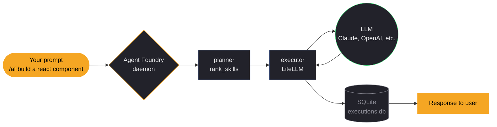
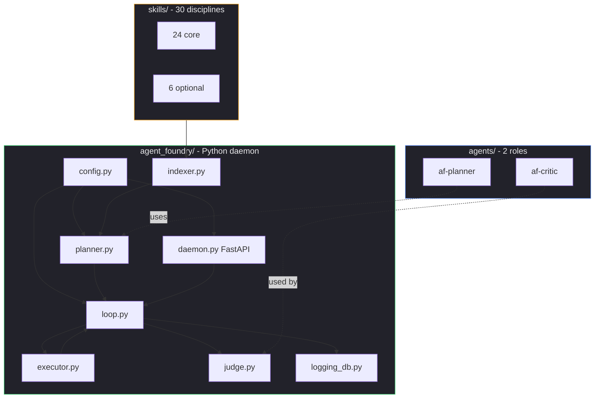
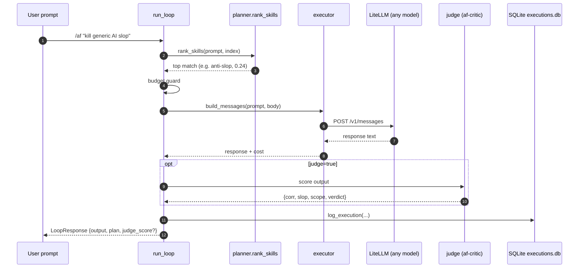

<div align="center">

# Agent Foundry

**A curated runtime orchestrator for AI coding assistants.**

Plan → execute → verify. Skills, agents, and a local daemon —
all MIT, all your data stays local.

<br>

[](LICENSE)
[](CHANGELOG.md)
[](https://www.python.org)
[](#catalog)
[](#catalog)
[](#quality-gates)
[](https://github.com/youcisla/Agent-Foundry/blob/main/scripts/nox.sh)
[](https://agent-foundry.vercel.app)

<br>

[**Quick start**](#quick-start) · [**Catalog**](#catalog) · [**Architecture**](#architecture) · [**Commands**](#commands) · [**Web app**](https://agent-foundry.vercel.app)

</div>

---

## Why Agent Foundry

> Models hallucinate. They over-comment. They reach for `npm install` when
> you asked for a one-line fix. Agent Foundry is a set of **disciplines**
> that steer the model toward the work — not the noise.

Three layers, each does one job:

| Layer | What | Lives in |
|---|---|---|
| **🧠 Skills** | Disciplines the model applies — *how to think*, not what to know | `skills/core/<name>/SKILL.md` |
| **🤖 Agents** | Roles the orchestrator can dispatch — critic, planner | `agents/af-*/AGENT.md` |
| **⚙️ Orchestrator** | Local daemon that ranks, dispatches, executes, logs, judges | `agent_foundry/` (Python) |

Each layer is portable. A skill body is a plain markdown file with a trigger
phrase. An agent is a role definition. The orchestrator is a Python package
you can `pip install` or run from source.

---

## Quick start

### 1. Install

```bash
curl -fsSL https://raw.githubusercontent.com/youcisla/Agent-Foundry/main/install.sh | bash
export ANTHROPIC_API_KEY=sk-...
```

### 2. Use it

In Claude Code (or any harness that accepts slash commands):

```bash
/af "build a react component"      # plan + execute
/plan "audit this API"             # see which skills match
```

Without a harness:

```bash
agent-foundry plan  "kill generic AI slop"
agent-foundry run   "refactor the API design"
agent-foundry doctor
```

### 3. Or browse first

→ **[agent-foundry.vercel.app](https://agent-foundry.vercel.app)** has the
full catalog, an interactive knowledge graph, and one-click install.

---

## Architecture



### What's in the box



The daemon is lazy-started by the CLI — no systemd/launchd requirement.
Everything runs locally. Your data stays in `~/.config/agent-foundry/executions.db`.

### The loop, end to end



---

## Catalog

**30 skills, 2 agents.** All original work under MIT. Each skill:

- 📏 **≤150 lines / ≤8 KB** — Codex cap, no exceptions
- 🎯 **Exactly one trigger phrase** — `Use when...` so the model knows when to fire
- 🚫 **Anti-patterns + Verification checklist** — teach what *not* to do, then confirm it was done
- ⚡ **Action verbs, not tool names** — `examine` not `Read`, `create` not `Write`

### Core skills (24)

| Skill | Trigger |
|---|---|
| [`anti-slop`](skills/core/anti-slop/SKILL.md) | Kill generic AI patterns before they ship |
| [`api-design`](skills/core/api-design/SKILL.md) | Use when creating a new API endpoint or reviewing API consistency |
| [`automation-pick`](skills/core/automation-pick/SKILL.md) | Decide whether to automate a task before automating |
| [`bottleneck-gating`](skills/core/bottleneck-gating/SKILL.md) | Phase a project by measured bottleneck, not intuition |
| [`constraint-then-solve`](skills/core/constraint-then-solve/SKILL.md) | Restate the problem, catalog constraints, then solve |
| [`context-optimization`](skills/core/context-optimization/SKILL.md) | Use on any task with >2K-token outputs, big files, or repeated reads |
| [`cron-troubleshoot`](skills/core/cron-troubleshoot/SKILL.md) | Debug a missing or wrong cron job |
| [`e2e-test-strategy`](skills/core/e2e-test-strategy/SKILL.md) | Use when designing test coverage for a web app or API |
| [`feedback-loop`](skills/core/feedback-loop/SKILL.md) | After shipping, instrument → measure → iterate |
| [`knowledge-extract`](skills/core/knowledge-extract/SKILL.md) | Turn a session into a skill draft |
| [`landscape-first`](skills/core/landscape-first/SKILL.md) | Research the space before building |
| [`measure-first`](skills/core/measure-first/SKILL.md) | Use when about to optimize, refactor, or claim a system is slow |
| [`plan-before-code`](skills/core/plan-before-code/SKILL.md) | Use before writing any non-trivial code change |
| [`plan-then-act`](skills/core/plan-then-act/SKILL.md) | Use when a task has multiple steps and the order matters |
| [`prompt-discipline`](skills/core/prompt-discipline/SKILL.md) | Use on every non-trivial task — think, simplify, edit surgical, stay goal-driven |
| [`pushback-when-wrong`](skills/core/pushback-when-wrong/SKILL.md) | Use when reviewing an assertion that smells off |
| [`quality-protocol`](skills/core/quality-protocol/SKILL.md) | Use before declaring a task complete |
| [`re-verify-findings`](skills/core/re-verify-findings/SKILL.md) | Use after any prior verification claimed a finding |
| [`read-before-build`](skills/core/read-before-build/SKILL.md) | Read source files before writing code |
| [`session-closeout`](skills/core/session-closeout/SKILL.md) | Apply at the end of any multi-step project |
| [`session-distill`](skills/core/session-distill/SKILL.md) | Extract patterns from every session |
| [`show-your-work`](skills/core/show-your-work/SKILL.md) | Output a thinking trace after complex tasks |
| [`verify-first`](skills/core/verify-first/SKILL.md) | Apply before committing to any claim |
| [`workflow-decompose`](skills/core/workflow-decompose/SKILL.md) | Use when designing or debugging an automation |

### Optional skills (6)

| Skill | Trigger |
|---|---|
| [`persistent-memory`](skills/optional/persistent-memory/SKILL.md) | Use when persisting context across sessions or threading memory across agents |
| [`token-compression`](skills/optional/token-compression/SKILL.md) | Compress tool outputs before they consume context |
| [`chrome-devtools-mcp-bridge`](skills/optional/chrome-devtools-mcp-bridge/SKILL.md) | Drive Chrome DevTools from an agent |
| [`design-language`](skills/optional/design-language/SKILL.md) | Apply Apple-grade UI polish |
| [`funnel-pr-guard`](skills/optional/funnel-pr-guard/SKILL.md) | Guard conversion-critical paths from breaking |
| [`sql-migration-trio`](skills/optional/sql-migration-trio/SKILL.md) | Three-file migration pattern (up/down/schema) |

### Agents (2)

| Agent | Model | Job |
|---|---|---|
| [`af-critic`](agents/af-critic/AGENT.md) | `opus` | Score output on correctness, slop, scope — returns JSON |
| [`af-planner`](agents/af-planner/AGENT.md) | `opus` | Decompose a request into a skill/agent plan — returns JSON |

---

## Commands

| Command | What it does |
|---|---|
| `agent-foundry plan "<prompt>"` | Rank skills for a prompt |
| `agent-foundry run "<prompt>"` | Plan + execute the top-ranked skill |
| `agent-foundry execute <skill_id> "<prompt>"` | Run a specific skill |
| `agent-foundry doctor` | Health-check: config, index, daemon, API key |
| `agent-foundry status` | Routing accuracy, fallback rate, average cost |
| `agent-foundry consult "<need>"` | Recommend skills for a need |
| `agent-foundry cost-report` | Token and time estimates per skill |
| `agent-foundry index` | Rebuild the skill index from disk |
| `agent-foundry serve` | Start the daemon (lazy-started on first command) |

Every command also has an HTTP endpoint on the daemon (`/plan`, `/execute`, `/loop`, `/index`, `/health`) for programmatic use.

---

## Install profiles

```bash
AF_PROFILE=minimal ./install.sh    # Skills only (no daemon)
AF_PROFILE=core    ./install.sh    # Skills + daemon (default)
AF_PROFILE=full    ./install.sh    # Skills + daemon + hooks
```

Or directly from PyPI:

```bash
pip install -e .
```

Or clone-and-link:

```bash
git clone https://github.com/youcisla/Agent-Foundry.git ~/.agent-foundry
cd ~/.agent-foundry && pip install -e .
```

---

## Requirements

- **Python 3.10+**
- A supported harness: Claude Code, Codex, Gemini, Hermes, or OpenCode
- An API key (Anthropic, OpenAI, or any provider LiteLLM supports)
- ~50 MB disk for the catalog and generated index

---

## Quality gates

Every commit runs three gates. **All green right now.**

```bash
# 32 assets pass static quality checks (trigger phrase, body size, anti-patterns)
python scripts/foundry-eval.py

# All skills have correct frontmatter (name, description, version, author)
./scripts/validate.sh

# No external-reference names in tracked files (provenance gate)
bash scripts/nox.sh
```

**Current:**

| Gate | Result |
|---|---|
| `foundry-eval.py` | **32 passed, 0 failed** ✅ |
| `validate.sh` | **30 skills, 0 failed** ✅ |
| `nox.sh` | **0 external references** ✅ |

The `nox.sh` gate is the strongest guarantee: it scans every tracked file for
vendor names (Claude, GitHub Copilot, etc.) so that the catalog stays original work.

---

## Web app

Browse the catalog, the knowledge graph, and the audit at
**[agent-foundry.vercel.app](https://agent-foundry.vercel.app)**:

| Page | What |
|---|---|
| [Catalog](https://agent-foundry.vercel.app/catalog) | All 30 skills + 2 agents with live search |
| [Graph](https://agent-foundry.vercel.app/graph) | Interactive knowledge graph (287 nodes, 467 edges) |
| [Audit](https://agent-foundry.vercel.app/audit) | God nodes, surprising connections, Mermaid diagrams |

The site regenerates from live repo state on every commit via
`scripts/gen-site-data.py` → Vercel build → deploy.

---

## Roadmap

| Status | Item |
|---|---|
| ✅ v0.1 | Python package + FastAPI daemon + Claude Code plugin |
| ✅ v0.2 | Foundational audit, frozen Config, multi-page web app, knowledge graph, Mermaid diagrams |
| 📋 v0.3 | Multi-harness adapters (Codex, Gemini, OpenCode, Hermes) |
| 📋 v0.4 | `af verify` signed-manifest integrity |

See [docs/launch-plan.md](docs/launch-plan.md) for the full design spec.

---

## License

**MIT.** All skills, agents, and authored artifacts are original work by
the Agent Foundry Contributors. See [AUTHORSHIP.md](AUTHORSHIP.md) for
the attribution policy.

---

<div align="center">

Built by [Youcisla](https://github.com/youcisla) ·
[Contribute](CONTRIBUTING.md) ·
[Report an issue](https://github.com/youcisla/Agent-Foundry/issues)

</div>